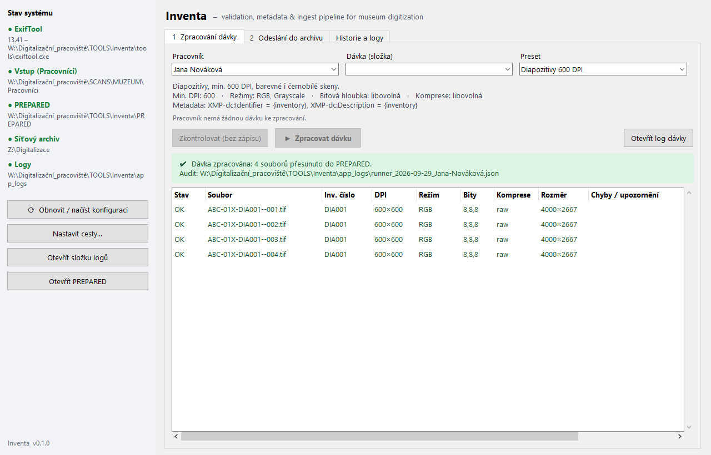
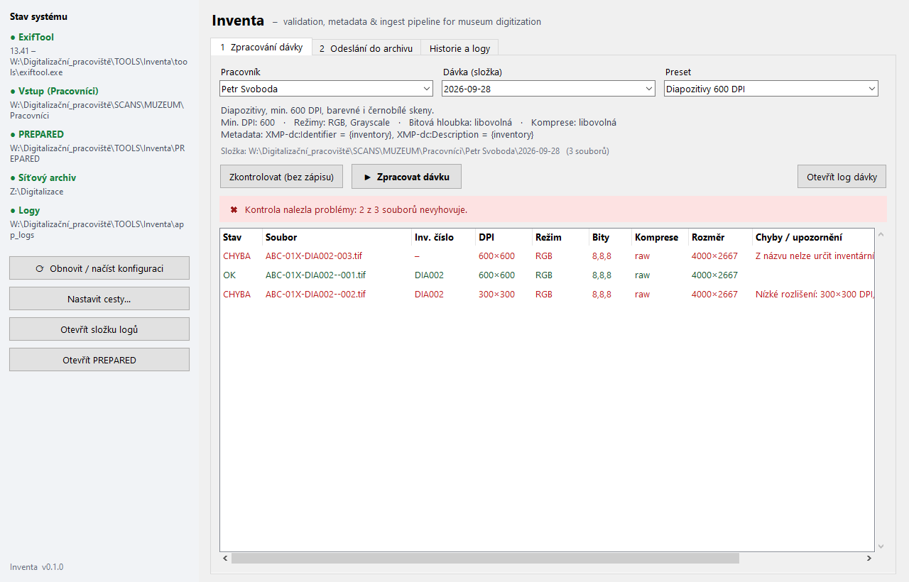
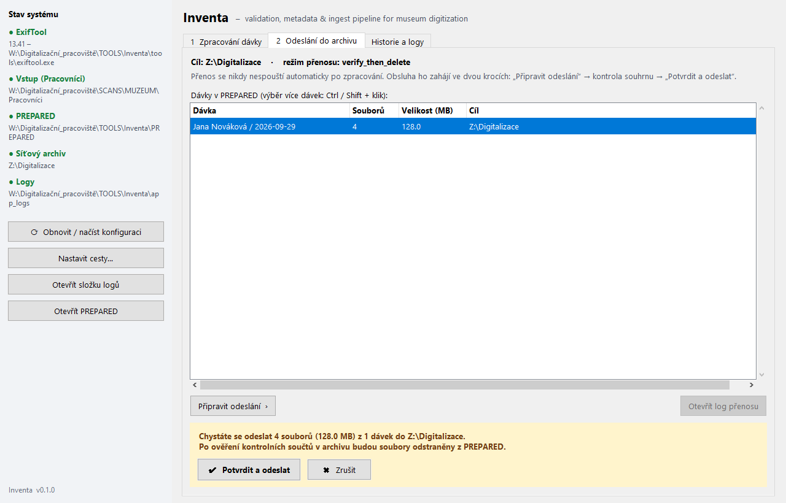
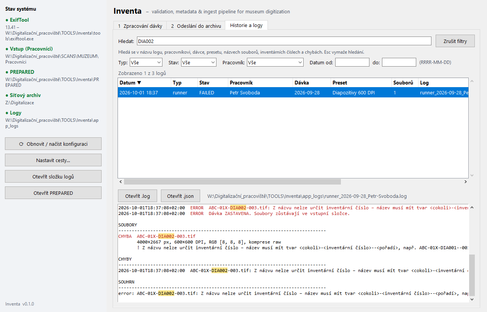

# Inventa

**Inventa – validation, metadata & ingest pipeline for museum digitization**

Desktopová aplikace pro Windows (běžné okno – **žádný server, localhost ani prohlížeč**) pro digitalizaci
muzejních sbírek. Kontroluje TIFF skeny, zapisuje Dublin Core metadata přes ExifTool, vede auditní
logy a na pokyn obsluhy přenáší hotové soubory na síťový archiv.







## Umístění a struktura

Doporučené uspořádání je níže – není ale povinné. Kde jsou skeny, síťový archiv a další složky,
si nastavíte přímo v aplikaci (tlačítko **Nastavit cesty…**).

```text
D:\Digitalizační_pracoviště\
├── TOOLS\
│   └── Inventa\                <-- tento repozitář
│       ├── config\presets.json  pravidla (presety, DPI, metadata, výchozí cesty)
│       ├── config\settings.json cesty nastavené v aplikaci (vznikne po prvním uložení)
│       ├── src\
│       │   ├── gui.py           desktopové okno (Tkinter – součást Pythonu)
│       │   ├── validator.py     kontrola TIFF / DPI / barev. režimu / názvu (Pillow)
│       │   ├── metadata.py      zápis + zpětné ověření metadat (ExifTool)
│       │   ├── logger.py        auditní JSON + .log, system_runner.log
│       │   ├── workflow.py      řízení celé dávky (kontrola -> metadata -> PREPARED -> archiv)
│       │   └── config.py        načtení a kontrola presets.json
│       ├── tools\exiftool.exe   portable ExifTool (stáhnout zvlášť, viz tools\README.md)
│       ├── app_logs\            věčný audit (nikdy se nepřepisuje)
│       ├── PREPARED\            pouze čisté, zpracované TIFFy (naplocho)
│       └── Inventa.bat          spuštění aplikace (dvojklik)
└── SCANS\<INSTITUCE>\Pracovníci\<Pracovník>\<YYYY-MM-DD>\   vstup od obsluhy
```

## Požadavky

* Windows 10 nebo 11
* Python 3.10 nebo novější (s Tkinterem – na python.org je výchozí součástí instalace)
* [ExifTool](https://exiftool.org/) (portable verze pro Windows, stahuje se zvlášť)
* pro odesílání do archivu síťový disk připojený pod písmenem (výchozí `Z:`)

## Instalace (jednorázově)

1. Nainstalujte **Python 3.10+** z [python.org](https://www.python.org/downloads/windows/)
   (ponechte zaškrtnuté *tcl/tk and IDLE* a *py launcher* – obojí je výchozí).
2. Stáhněte poslední verzi z [Releases](../../releases/latest) – soubor **Source code (zip)**.
3. Před rozbalením ZIPu: pravý klik → **Vlastnosti** → zaškrtněte **Odblokovat** → OK.
   (Jinak Windows u staženého `Inventa.bat` zobrazí varování SmartScreen.)
4. Rozbalte ZIP a vzniklou složku (např. `Inventa-0.1.0`) přejmenujte na `Inventa` a přesuňte ji,
   kam potřebujete – doporučeně do `D:\Digitalizační_pracoviště\TOOLS\`.
5. Do složky `tools\` vložte portable ExifTool podle [tools/README.md](tools/README.md).
6. Spusťte `Inventa.bat` (dvojklik). Při prvním spuštění vytvoří `.venv` a nainstaluje jedinou
   závislost – Pillow (vyžaduje internet, trvá cca minutu). Poté otevře okno aplikace; černá konzole se sama zavře.
7. Při prvním spuštění se otevře okno **Nastavení cest**. Tlačítkem **Procházet…** vyberte:
   * **Vstupní složka se skeny** – složka, ve které má každý pracovník svou podsložku s dávkami,
     např. `D:\Digitalizační_pracoviště\SCANS\MUZEUM\Pracovníci`,
   * **Síťový archiv** – kam se odesílají hotové soubory, např. `Z:\Digitalizace`.

   PREPARED, logy a ExifTool mají rozumné výchozí hodnoty uvnitř složky aplikace, není třeba je měnit.
   Cesty lze kdykoli změnit tlačítkem **Nastavit cesty…** v levém panelu; ukládají se do `config\settings.json`.
8. V levém panelu **Stav systému** by měly všechny položky svítit zeleně. Červená položka ukazuje,
   kterou cestu nebo nástroj je potřeba opravit.

Tip: na plochu vytvořte zástupce na `Inventa.bat`.

**Aktualizace na novou verzi:** stáhněte nový ZIP a přepište jím složku `Inventa`. Vaše cesty
(`config\settings.json`), ExifTool (`tools\`) a audit (`app_logs\`) nový ZIP nepřepíše, protože v něm nejsou.
Pokud jste upravovali presety, `config\presets.json` si předem zazálohujte.

## Životní cyklus dávky

| Krok | Co se děje |
|---|---|
| 1. Vstup | Obsluha nahraje TIFFy do `SCANS\<INSTITUCE>\Pracovníci\<Jméno>\<YYYY-MM-DD>\`. |
| 2. Výběr | V okně aplikace zvolíte pracovníka, dávku a preset. |
| 2b. Kontrola nanečisto | Tlačítko **Zkontrolovat (bez zápisu)** projde *všechny* soubory a ukáže všechny chyby najednou. Nic nemění a nezapisuje do auditu. |
| 3. Validace | **Zpracovat dávku**: přípona `.tif/.tiff`, skutečný formát TIFF, DPI ≥ minimum, barevný režim, (volitelně) bitová hloubka a komprese, tvar názvu a extrakce inventárního čísla (viz níže). **První chyba dávku okamžitě zastaví** (červená hláška + chybové okno + detail v logu). |
| 4. Metadata | Teprve když projdou *všechny* soubory, ExifTool zapíše `XMP-dc:Identifier` a `XMP-dc:Description`. Zápis se hned zpětně přečte a ověří. SHA-256 se počítá před zápisem i po něm. |
| 5. PREPARED | TIFFy se přesunou **naplocho** do `PREPARED\` (`Thumbs.db` apod. se zahodí, prázdná složka dávky se odstraní). Pokud už v PREPARED soubor se stejným názvem je, dávka se zastaví dřív, než se cokoli změní. |
| 6. Audit | `app_logs\runner_YYYY-MM-DD_Jmeno-Prijmeni.json` (strojový, pro import do SQL) + `.log` (časová osa). Při opakování vznikne `_run2`, `_run3`, … Nic se nepřepisuje. |
| 7. Archiv | **Nikdy neproběhne automaticky.** Obsluha v záložce **Odeslání do archivu** vybere dávky, klikne **Připravit odeslání**, zkontroluje souhrn a teprve druhým krokem **Potvrdit a odeslat** spustí přenos: robocopy na `Z:\…` (naplocho), ověření SHA-256 v cíli proti auditu, pak smazání z PREPARED. Log `upload_YYYY-MM-DD.json/.log`. |

## Presety (`config/presets.json`)

```jsonc
"Diapozitivy 600 DPI": {
  "min_dpi": 600,
  "allowed_color_modes": ["RGB", "Grayscale"],   // RGB, Grayscale, Bitonal, CMYK, RGBA
  "allowed_bit_depths": null,                     // např. [8, 16]; null = nekontroluje se
  "allowed_compressions": null,                   // např. ["raw", "tiff_lzw"]
  "deep_check": false,                            // true = plné dekódování (odhalí poškozené soubory, pomalejší)
  "metadata": {
    "XMP-dc:Identifier": "{inventory}",
    "XMP-dc:Description": "{inventory}"          // ABC-01X-DIA001--001.tif -> "DIA001"
  }
}
```

* **Inventární číslo** se bere vždy z názvu souboru stejným pravidlem pro všechny presety:
  úsek mezi posledním `-` a `--`. Tvar názvu: `<cokoli>-<inventární číslo>--<pořadí>.tif`.

  | Název | Inventární číslo |
  |---|---|
  | `ABC-01X-DIA001--001.tif` | `DIA001` |
  | `ABC-01X-FOT123--002.tif` | `FOT123` |
  | `DIA001--001.tif`, `ABC-01X-DIA001-001.tif` | chyba – nelze určit |

* V šablonách metadat lze použít `{inventory}`, `{prefix}` (část před inv. číslem), `{sequence}` (pořadí),
  `{worker}`, `{batch}`, `{preset}` a `{filename}`.
* Chybu v `presets.json` aplikace ohlásí červeně i s popisem (řádek, neznámý režim, …).
* Úplná kopie presetu se ukládá do každého JSON logu, takže audit zůstane srozumitelný i po změně pravidel.

## Historie a logy

Záložka **Historie a logy** zobrazuje všechny auditní záznamy z `app_logs`:

* **Typ** `runner` = zpracování dávky, `upload` = přenos do archivu.
* **Hledat** – hledá v názvu logu, pracovníkovi, dávce, presetu, názvech souborů, inventárních číslech
  i textech chyb (více slov = musí platit všechna). `Esc` vymaže hledání.
* **Filtry** podle typu, stavu, pracovníka a data (od–do), tlačítko **Zrušit filtry**.
* Klik na záhlaví sloupce řadí (▲/▼), výchozí je nejnovější nahoře.



* Vybraný log se zobrazí dole – chybové řádky červeně, hledaný výraz žlutě. Dvojklik nebo
  **Otevřít .log / .json** otevře soubor v systému.

## Bezpečnostní a provozní poznámky

* **Diakritika v cestách** (`Digitalizační_pracoviště`): ExifTool na Windows nezvládá Unicode
  argumenty z příkazové řádky, proto se parametry předávají přes UTF-8 argfile (`-@`) a `-charset filename=utf8`.
* **Přenos do archivu** probíhá ve výchozím režimu `verify_then_delete`: robocopy soubory zkopíruje,
  aplikace ověří SHA-256 přímo na `Z:` a teprve potom smaže zdroj v PREPARED. Režim `robocopy_move`
  (čisté `/MOV`) je k dispozici, ale při chybě ověření by zdroj už neexistoval.
* Přenos odmítne soubor, ke kterému neexistuje úspěšný auditní záznam, nebo který se po zpracování změnil.
  Nikdy nepřepíše jiný soubor se stejným názvem v archivu; identickou kopii (např. po přerušeném přenosu) jen ověří.
* Aplikace je čistě desktopová: neotevírá žádný síťový port a nic neodesílá mimo síťový archiv.
* Během zpracování/přenosu okno dál reaguje (práce běží na pozadí). Zavření okna uprostřed operace
  vyžaduje potvrzení.
* Zápis metadat mění TIFFy na místě (`-overwrite_original`). Pokud dávka selže až při zápisu
  metadat, část souborů už metadata mít může. Opakované zpracování je bezpečné (zapisují se stejné hodnoty).

## Ukázková data

Screenshoty v `docs/` jsou pořízené na fiktivních datech (smyšlení pracovníci, instituce i inventární čísla).

## Vývoj

```bash
python -m pip install -r requirements.txt   # na Windows: "pip" samotný často není v PATH
python src/gui.py                           # spuštění okna s konzolí (vidíte případné chyby)
```

## Licence

[MIT](LICENSE) – aplikaci můžete volně používat, upravovat i šířit, jen zachovejte text licence.
Bez záruky: před nasazením na ostrá data si ověřte, že presety odpovídají pravidlům vaší sbírky.
